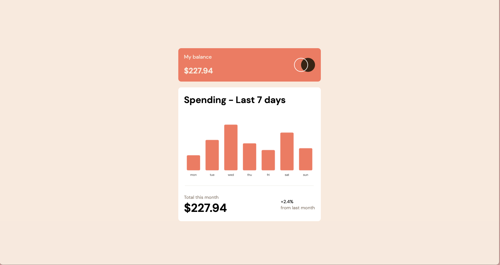

# Frontend Mentor - Expenses chart component solution

This is a solution to the [Expenses chart component challenge on Frontend Mentor](https://www.frontendmentor.io/challenges/expenses-chart-component-e7yJBUdjwt). Frontend Mentor challenges help you improve your coding skills by building realistic projects.

## Table of contents

- [Overview](#overview)
  - [The challenge](#the-challenge)
  - [Screenshot](#screenshot)
  - [Links](#links)
- [My process](#my-process)

  - [Built with](#built-with)
  - [What I learned](#what-i-learned)

  - [Useful resources](#useful-resources)

- [Author](#author)

## Overview

### The challenge

Users should be able to:

- View the bar chart and hover over the individual bars to see the correct amounts for each day
- See the current day’s bar highlighted in a different colour to the other bars
- View the optimal layout for the content depending on their device’s screen size
- See hover states for all interactive elements on the page
- **Bonus**: Use the JSON data file provided to dynamically size the bars on the chart

### Screenshot



### Links

- Solution URL: [Add solution URL here](https://github.com/christytan/expense-chart)
- Live Site URL: [Add live site URL here](https://ct-expense-chart.netlify.app/)

## My process

### Built with

- Semantic HTML5 markup
- CSS custom properties
- Flexbox
- ChartJS API

- [React](https://reactjs.org/) - JS library

### What I learned

```js import json file
import date from "./data.json" assert { type: "json" };
```

### Useful resources

- [JSON import](https://www.freecodecamp.org/news/how-to-read-json-file-in-javascript/) - This helped me for how to import static json file as external resource.
- [ChartJS guidance](https://stackoverflow.com/questions/38593123/how-to-hide-y-axis-line-in-chartjs) - This is a great guidance on how to modify the axis in ChartJs.

## Author

- Website - [christy tan](https://christychentan.netlify.app/)
- Frontend Mentor - [@christytan](https://www.frontendmentor.io/profile/christytan)
